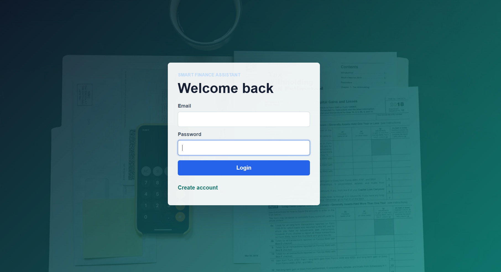
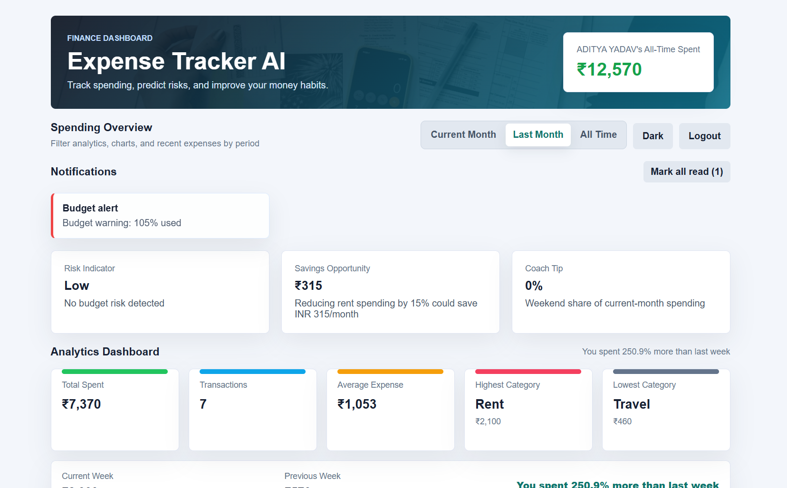
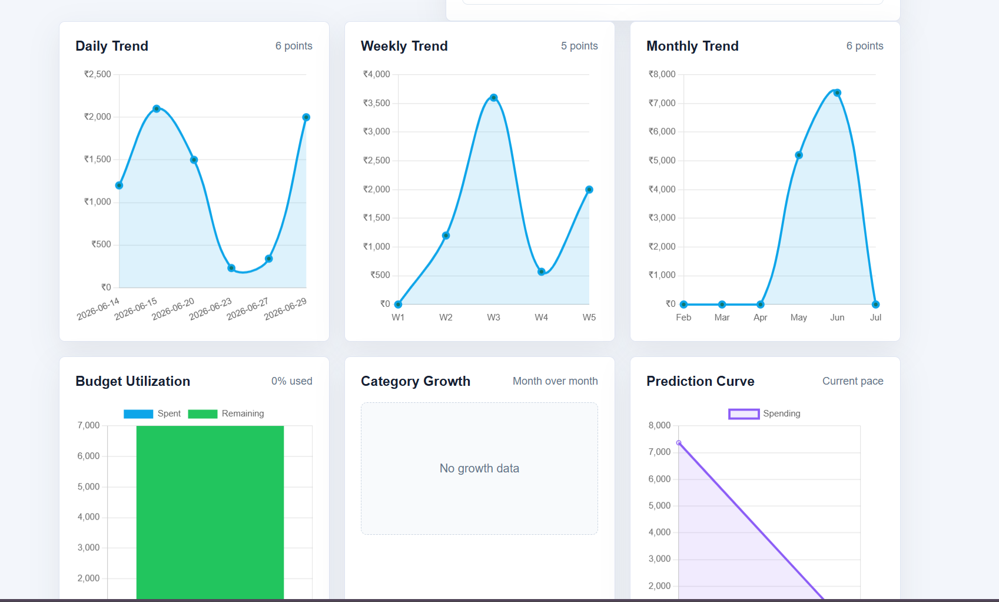
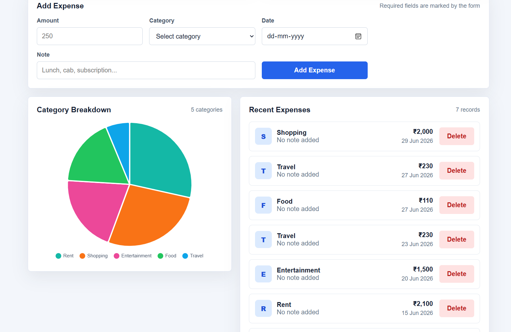

# Smart Finance Dashboard

> A production-ready MERN finance dashboard for tracking expenses, managing budgets, viewing analytics, and generating AI-powered spending insights.

---

## 📌 Overview

Smart Finance Dashboard is a full-stack personal finance web application built with the MERN stack. It helps users securely manage expenses, monitor budgets, understand spending behavior, and view interactive financial analytics through a clean, responsive dashboard.

The project is designed to demonstrate practical full-stack development skills, including authentication, REST API design, MongoDB data modeling, analytics workflows, responsive UI development, and cloud deployment.

---

## 🎯 Project Objective

The objective of this project is to showcase modern MERN full-stack development through a complete finance management platform. It demonstrates secure user authentication, budgeting features, analytics dashboards, cloud deployment, and a responsive interface suitable for both desktop and mobile users.

---

## ✨ Professional Highlights

- Full Stack MERN Application
- JWT Authentication
- MongoDB Atlas
- REST API
- Interactive Charts
- Budget Management
- AI Spending Insights
- Responsive Design
- Mobile Friendly
- Cloud Deployment (Vercel + Render)

---

## 🚀 Features

- Secure user authentication with JWT-based sessions
- Add, view, and delete expenses
- Category-based expense tracking
- Budget monitoring and risk indicators
- Spending overview by selected time period
- Interactive daily, weekly, and monthly analytics charts
- Category breakdown visualization
- AI-powered spending insights and coach tips
- Notification support for budget alerts
- Responsive layout optimized for desktop and mobile

---

## 🛠️ Tech Stack

| Layer | Technology |
|-------|------------|
| Frontend | React.js |
| Backend | Node.js + Express.js |
| Database | MongoDB Atlas |
| Authentication | JWT |
| Charts | Chart.js + React Chart.js 2 |
| HTTP Client | Axios |
| Styling | CSS |
| Deployment | Vercel & Render |

---

## 📁 Project Structure

```text
smart-finance-dashboard/
├── backend/
│   ├── ai/
│   ├── analytics/
│   ├── controllers/
│   ├── middleware/
│   ├── models/
│   ├── routes/
│   ├── services/
│   ├── utils/
│   ├── package.json
│   └── server.js
├── frontend/
│   ├── public/
│   ├── src/
│   │   ├── charts/
│   │   ├── components/
│   │   ├── context/
│   │   ├── hooks/
│   │   ├── services/
│   │   └── utils/
│   └── package.json
├── screenshots/
│   ├── login-page.png
│   ├── dashboard.png
│   ├── analytics.png
│   └── expense-management.png
└── README.md
```

---

## ⚙️ Installation

Clone the repository:

```bash
git clone https://github.com/aditya22439/smart-finance-dashboard.git
cd smart-finance-dashboard
```

Install backend dependencies:

```bash
cd backend
npm install
```

Install frontend dependencies:

```bash
cd ../frontend
npm install
```

Start the backend server:

```bash
cd ../backend
npm start
```

Start the frontend application:

```bash
cd ../frontend
npm start
```

---

## 🔐 Environment Variables (.env.example only)

Create environment files from the examples below. Do not commit real secrets.

### Backend `.env.example`

```env
PORT=5000
MONGO_URI=your_mongodb_atlas_connection_string
JWT_SECRET=your_secure_jwt_secret
DNS_SERVERS=8.8.8.8,1.1.1.1
```

### Frontend `.env.example`

```env
REACT_APP_API_URL=https://smart-finance-backend-6end.onrender.com
```

---

## 🌐 Live Demo

| Resource | Link |
|----------|------|
| Frontend | https://smart-finance-dashboard-ruby.vercel.app |
| Backend API | https://smart-finance-backend-6end.onrender.com |
| GitHub Repository | https://github.com/aditya22439/smart-finance-dashboard |

---

## 🖼️ Screenshots

## Login Page


## Dashboard


## Analytics Dashboard


## Expense Management


---

## 🔮 Future Improvements

- Dark Mode Enhancements
- Edit Expenses
- Recurring Expenses
- Email Notifications
- AI Recommendations
- Multi-Currency Support
- Progressive Web App (PWA)
- Expense Search & Filters

---

## 👤 Author

**Aditya Yadav**

GitHub: https://github.com/aditya22439
LinkedIn:www.linkedin.com/in/aditya-yadav-0a54y85d


---

## 📄 License

This project is available for educational and portfolio purposes. Add a license file if you plan to distribute or accept external contributions.
